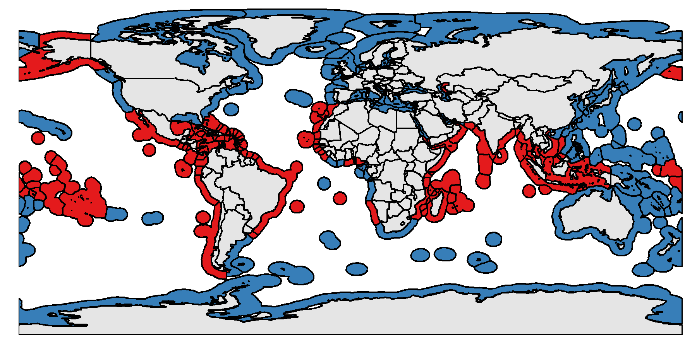

```{r, echo = F}
knitr::opts_chunk$set(echo = FALSE,
                      warning = FALSE,
                      message = FALSE)


suppressPackageStartupMessages({
  library(lubridate)
  library(here)
  library(estimatr)
  library(knitr)
  library(tidyverse)
  library(texreg)
})
```

# Question 1

1. Use the definition of “teleconnected” (TE) and “weakly affected” (WA) locations in Hsiang, Meng and Cane (henceforth HMC), as shown in Fig. 1a and Supplementary Fig. 3, to assign ocean pixels as either TE or WA. Report maps showing TE and WA areas at the (a) pixellevel and (b) at the EEZ level.

I use the monthly NINO3.4 index anomaly and monthly 1-degree Sea Surface Temperature reconstructions (1869 - 2018) data provided by NOAA to identify teleconnected (TE) and weakly affected (WA) ocean pixels, following HMC \citep{hsiang_2011}. NINO3.4 is preferred over NINO3, as it has been recently shown to better represent the ocean-atmosphere interface dynamics. However, all variations of NINO index are highly correlated between each other (Fig 4). All data and code are available on a GitHub [repository](https://github.com/jcvdav/gfw_enso/). Particularly, there are three key scripts that identiy TE and WA pixels:

- [`scripts/2_processing/2_cor_sst_nino34_2deg.R`](https://github.com/jcvdav/gfw_enso/blob/master/scripts/2_processing/2_cor_sst_nino34_2deg.R): For each pixel, it calculates the correlation between SST and NINO3.4 anomaly index.

- [`scripts/2_processing/3_identify_teleconnected_pixels.R`](https://github.com/jcvdav/gfw_enso/blob/master/scripts/2_processing/3_identify_teleconnected_pixels.R): Identifies pixels for which SST was positively and significantly correlated with NINO3.4 anomaly for at least three months as shown in Figure 1 (with robustness checks for 5 months in Figure 2).

- [`scripts/2_processing/4_identify_teleconnected_eezs.R`](https://github.com/jcvdav/gfw_enso/blob/master/scripts/2_processing/4_identify_teleconnected_eezs.R): For each polygon of an EEZ, calculates the proportion of pixels that are TE or WA. If more than 50% are TE, then the entire polygon is classified as TE. The resulting EEZ categorization is shown in Figure 3.





\clearpage

# Question 2

2. Using total fishing hours at the EEZ-by-time level, estimate the ENSO-sensitivity of fishing hours separately for TE and WA EEZs (as defined in part 1(b)). Justify your model specification (*i.e.*, controls, standard error assumptions, functional forms, etc) and choices made regarding how ENSO enters into your model (*i.e.*, functional form, ENSO timing, etc). Report results.

The panel used here was generated with a script at [scripts/2_processing/8_create_eez_foreign_fishing_panel.R](https://github.com/jcvdav/gfw_enso/blob/master/scripts/2_processing/8_create_eez_foreign_fishing_panel.R). I have compiled foreign and local fishing hours and kilowat usage for three main gears: drifting longlines, tuna purse seines, and trawlers (as identified by GFW). For this analysis, I will focus on tuna purse seine fishing hours from 2012 - 2018. Trawlers largely operate in the bottom, at depths at which water temperature may not be affected by ENSO events, that largely affect the mixed layer depth, particularly above the termocline. Longliners operate largely in the pelagic environment, beyond national jurisdictions. Therefore, the there is no distinction between "foreign" and "domestic" fishing hours. The first few lines of the columns of interest are shown in Table 1.

```{r}

sate1 <- date("2014-06-01")
sate2 <- date("2015-12-31")
sate3 <- date("2017-01-01")

# Read the data and prepare it
panel <- readRDS(file = here("data", "eez_fishing_effort_treatment_panel.rds")) %>% 
  filter(best_vessel_class == "tuna_purse_seines") %>% 
  select(year, month, nino34anom, eez_iso3, status_c, status, foreign_hours, total_hours, prop_hours_foreign) %>%
  mutate(date = lubridate::date(paste(year, month, 1, sep = "-")),
         sate = case_when(date < sate1 ~ "1",
                          date < sate2 ~ "2",
                          date < sate3 ~ "3",
                          T ~ "4"),
         status = status * 1)

# Show first few lines of January 2018
filter(panel, year == 2018, month == 1) %>% 
  select(-c(date, status)) %>% 
  head(10) %>% 
  kable(booktabs = T, digits = 2, caption = "First few rows of the panel")
```

There are some important factors to consider in order to estimate the ENSO-sensitivity of fishing hours for TE and WE EEZs. First, the "detectability" of fishing activity has improved through time. The addition of satellites to the constellation used to detect AIS leads to better detection of fishing activity in recent years, which may bias results. Before June, 2014 there were only three satellites, then 6 until December 2015, and then 10 until January 2017. I therefore include four dummies for each different "period" of satellite coverage as: 01/2012 - 06/2014, 06/2014 - 12/2015, 12/2015 - 01/2017, 01/2017 - present (Fig 5). If we didn't have this information, a linear trend that captures slow increases in overall fishing and ENSO could be used, as HMC do in their estimation of ACR and ENSO effects.

Each EEZ is likely to be subject to different levels of fishing (both local and foreign) due to the "quality" of the fishing grounds in them, as well as levels of enforcement and fisheries management overall. For this reason, it is sensible to include EEZ-level fixed effects that can account for this unobserved characteristics. Additionally, since I have repeated observations through time for each unit, there is likely to be within-EEZ correlation and heteroskedasticity in fishing activity. Therefore, standard errors should be clustered at the EEZ-level. I use the "stata-like" variance estimator, which is similar to Cluster-Robust (*i.e.* CR0) but includes a finite-sample correction of the form: $\frac{N-1}{N-K}\frac{S}{S-1}$ with N for sample size, S for number of clusters, and K for the number of estimated coefficients (my clusters do not approach infinity: 75 EEZs are TE, 85 are WA).

Fishing effort follows well-documented seasonal patterns. For example, when looking at aggregate measures of effort, one can see the "signature" of Christmass and Newyears, or the Chinese fishing closure \citep{kroodsma_2018}. While ENSO events usually develop towards the end of the year, there is little colinearity between NINO3.4 and month (Figure 6), and not accounting for seasonality may result in confounded estimates of ENSO-sensitivity of fishing. For this reason, I include month-fixed effects in my estimation.

The measures of ENSO indices are obtained after the event is realized (*i.e.* at the end of the month). Fishing operations are likely driven by their immediate exposure (*i.e.* "If fishing grounds are not the right ones now, I will not fish here now" - I discuss choice of fishing later, when I talk about using vessels as the unit of observation). I use contemporary NINO3.4 indices to characterize the variation to which EEZs were exposed in a given month. The indices show significant serial correlation (Fig 7), and including lags would not change results dramatically. We are interested in the number of additional hours explained by ENSO, so I will include NINO3.4 with a linear trend only.

My estimation model therefore contains:

- Linear effect of the NINO3.4 index, captured by $\beta$
- Controls for addition of satellites, captured by a vector $\Omega$ of length three, with the first period modelled as the reference level (See Fig S2)
- month-level fixed effects, captured by vector $\mu$ of length 11 and january modelled as the reference level
- EEZ-level fixed effects, captured by a vector $\gamma_i$ of length number-of-countries minus 1 (either 74 or 84, depending on the case)
- Standard errors clustered at the EEZ-level

The total fishing hours in EEZ $i$ and time $t$ are given by:

$$
hours_{i,t} = \beta_0 + \beta_1NINO_{t} + \mu MONTH_t + \gamma_i EEZ_i + \Omega SATE_t + \epsilon_{i,t}
$$

ENSO-sensitivity of total fishing hours for TE and WA EEZs is shown in Table 2. The coefficient of interest for this estimation, $\beta_1$, shows different responses for TE and WA EEZs. In WA areas, (fist column), a one-unit increase in the NINO3.4 index *decreases* total fishing hours by . However, this coefficient is not significantly different from zero, implying that ENSO does not affect the total fishing hours in WA EEZs (at least not at a detectable level). For the TE EEZs, we observe a positive coefficient, which would suggest that a one-unit increase in the NINO3.4 index *increases* total fishing hours. This coefficient, however, is not different from zero, and I can not reject the null that total fishing hours are not affected by ENSO events (as infered by NINO3.4 anomaly). For both cases, the satellite dummies have the expected direction (positive), indicating that an addition of satellites leads to better detection of total activity. (The last section contains simpler models where some assumptions are relaxed. I woul dnormally present those as the primary model, with other more complex candidates in thesuplements but thought I'd include the ones that match my equation here.)

While not significantly different from zero, the coefficients identified by the ENSO-sensitivity tests have, to an extent, the expected direction. As productivity goes down in TE EEZs, fishers are forced to fish harder to catch the same amount of fish (more on this later). However, it is difficult to immediately reconcile the reduction of fishing hours in WA EEZs. More of this is discussed later in part 4.

```{r enso-sensitivity, results = "asis"}

th_model <- function(data) {
  lm_robust(total_hours ~ nino34anom + eez_iso3 + as.factor(month) + sate,
            data = data,
            clusters = eez_iso3,
            se_type = "stata")
}

region_level_panel <- panel %>% 
  mutate(total_hours = total_hours) %>% 
  group_by(status_c) %>% 
  nest()

th_model <- region_level_panel %>% 
  mutate(model = map(data, th_model))

texreg(th_model$model,
       caption = "ENSO-sensitivity of total fishing hours in ENSO teleconnected (TE) and weakly affected (WA) EEZs.",
       single.row = T,
       omit.coef = "(iso3)|(month)",
       custom.note = "%stars. Standard errors are clustered at the EEZ-level and shown in parentheses.",
       custom.model.names = as.character(th_model$status_c),
       caption.above = T,
       include.ci = F,
       float.pos = "h",
       label = "a")
```

\clearpage

# Question 3

3. Using total fishing hours at the EEZ-by-time level, estimate a “difference-in-difference” model of fishing hours for TE-EEZs relative to WA EEZs. Again, justify your model specification and choices made regarding how ENSO enters into your model. Report results. How does one interpret these estimates relative to those in part 2?

In addition to assuming relevance (that an effect exists) here are two key assumptions that I make when using a difference-in-differences approach: a) excludability and b) no interference \citep{ferraro_2018}. The excludability assumption states that any confounding factors or rival explanations have been excluded or controlled for. In this case, the counterfactual approach of using WA EEZ assumes that time-varying variables affect WA and TE EEZs equally, and that any other piophysical responses driving fishing effort are homogeneous between groups. Since I don't think satellite addition affects them equally, I decide to control for this (more on this below). By combining the counterfactual approach and these satellite dummies, the excudability assumption is likely satisfied. I will still test for specifications that include / exclude satellite dummies.

The no-interference assumption states that there are no spillover effects between my TE and WA EEZs. This requires that any changes in total fishing hours in TE EEZs does not affect total hours in WA EEZs. Under the current problem set up, it seems difficult to test for this assumption. A possible way to do this is to track individual vessels and see if they move across TE and WA areas. Another way in which fisheries in TE and WA areas may be connected is through markets. If fish production decreases in TE areas overall, WA areas may try to meet the (plausibly) constant demand by increasing their harvest. One may test for this by looking at catch (or fish production) through time (and ENSO phases) for TE and WA countries and test for increases in production from WA countries. For time and computational limitations, I will not perform such test here because data are not readily available to me.

As before, this "difference-in-differences" estimation includes EEZ-level fixed effects and clustered standard errors. Since the seasonality (*i.e.* month fixed-effects) affects both groups equally, I will drop these from this regressions (but see supplementary materials for a case where I keep them and results are unchanged.) One might expect the addition of satellites to equally affect TE and WA EEZs, and therefore drop the satellite dummies. However, a portion of AIS data are also detected with land-based antenas. Developed countries, largely in boreal regions and within our WA EEZs, have beter AIS coverage via land-based antenas. The baseline coverage of fishing activity for this EEZs before addition of satellites is greater. Addition of satellites is likely to have a differential impact in the amout of fishing activity that becomes detectable. I will continue to include satellite dummies to account for the addition of satellites, but will also fit a model dropping these dummies. I would expect the NINO34 term (*i.e.* $\beta_1$ to "suck up" any of this effect). Here, I include two additional variables:

- A term for `STATUS`, which is a dummy variable that indicates if an EEZ is teleconnected ($STATUS = 1$) or weakly affected ($STATUS = 0$). The $\beta_2$ coefficient captures the mean baseline difference in total hours between TE and WA groups.

- An interaction term between NINO3.4 and $STATUS$ (*i.e.* TE or WA). The $\beta_3$ coefficient captures the differential change in total hours for TE EEZs, relative to WA EEZs.

The model is therefore: 

$$
hours_{i,t} = \beta_0 + \beta_1NINO_{t} + \beta_2 STATUS_i + \beta_3 STATUS_i + \times NINO_t \gamma_i EEZ_i + \Omega SATE_t + \epsilon_{i,t}
$$

As seen in the equation above, this specification of a Difference-in-Differences does not follow the usual specification of a dummy variable for before-after that gets interacted with a treatment dummy (*i.e.* `STATUS`, in this case). Instead, I use the NINO3.4 index as a gradual treatment and try to estimate the departure of total hours in TE EEZs relative to that of WA EEZs when NINO3.4 increases. Therefore, the interpretation of the coefficient of interest (the one in the interaction term $\beta_3$) remains the same (provided that the identification strategy is correct, to be discussed later).

\clearpage

The results in part two showed how ENSO affected total hours in TE (increase) and WA (decrease) EEZs. The opposite signs identified in part two would imply that the $\beta_3$ coefficient here should have a positive value (*i.e.* as NINO3.4 causes total hours to decrease in WA, it also causes total hours to increase in TE). Table 3 shows that this interaction term (labeled `status:nino34anom`) is, in fact, positive. As NINO3.4 increases, total hours decrease in WA EEZs. Relative to this negative trend, and due to the previously identified positive sensitivity in TA EEZs, the $\beta_3$ coefficient is positive and of the expected magnitude.

The inclusion / exclusion of satellite dummies shows that some confounding exists ($\beta_3$ can vary by up to 8\%). As expected, the NINO34 index, which is time-varying, captures the effect of addition of satelites. This is an important note, because addition of satellites seems to confound the $\beta_3$ estimate. However, the estimates for $\beta_0$ (intercept) and $\beta_2$ (status) are more robust to the inclussion of this dummies.

```{r diff-in-diff, results = "asis"}
th_did <- lm_robust(total_hours ~ status * nino34anom + eez_iso3 + sate,
                    data = panel,
                    clusters = eez_iso3,
                    se_type = "stata")

th_did2 <- lm_robust(total_hours ~ status * nino34anom + eez_iso3,
                    data = panel,
                    clusters = eez_iso3,
                    se_type = "stata")

texreg(list(th_did, th_did2),
       caption = "Difference-in-differnce estimates for total fishing hours and NINO3.4 across TE and WA areas.",
       single.row = T,
       omit.coef = "(iso3)|(month)",
       custom.note = "%stars. Standard errors are clustered at the EEZ-level and shown in parentheses.",
       custom.model.names = c("Total Hours", "Total Hours"),
       caption.above = T,
       include.ci = F,
       float.pos = "h",
       label = "b")
```

\clearpage

# Question 4

4. Discuss what the results in parts 2 and 3 tell us about the biophysical effects of ENSO versus the economic response to the biophysical effects of ENSO. Propose empirical tests for separating these two effects (you don’t need to implement these tests).

There are a series of considerations to be made before concluding on the effects that the above tests might have identified. A short description of the NINO3.4 index and SST, as well as the known effect of ENSO on ocean dynamics is warranted to better understand both pieces of this question.

First, the NINO3.4 index is essentially a representation of the mean Sea Surface Temperature along the equatorial region of the Pacific Ocean. Specifically, the NINO3.4 index calculates the 5-month running mean of SST in the region encompassed in (5N-5S, 170W-120W). As such, SST in the Pacific is more likely to be correlated with this measure due to proximity (this may already result in a bias of our definitions of TE and WA, to be discussed later). An El Nino event (positive ENSO phase) can be declared if the NINO3.4 anomally is greater than $\pm$ 0.4 C for a period of six months or more. Changes in ENSO phases are known to drive productivity in the oceans, temporarily modify species distribution, and cause a depening of the termocline (in the eastern Pacific). All of these are likely to affect the profitability of fishing activities and the decision-making process of fishers.

In part 1, we classified the ocean into regions wherre biophysical responses are likely to be driven by ENSO. However, the results in part 2 and part 3 (quantifying changes in total fishing hours with respect to changes in SST) don't tell us much in terms of the the biophysical effects of ENSO. For example, we do not observe *actual* changes in species distribution, sea surface temperature or productivity, or even catches of the likely targeted species. As it stands, we can only see the expected response of fishing hours responding differently to NINO3.4.

However, the exact variation in biophysical conditions that drive fishing effort are not clear, and so far depend exclusively on the definition of TE and WA EEZs. Moreover, the current model specification assumes that any time-varying variables can be accounted for with the use of a counterfactual. Any biophysical conditions that drive the decision-making process but that don't vary in time are accounted for in the EEZ-fixed effects, but these don't tell us much about the linkage between ENSO - biophysical changes - fishing effort. Finally, we don't assume country-specific trends, and therefore could be losing important information if some countries show a particularly high increase in total hours while others show a particularly decrease. These heterogeneous effects could be avaraged out in our approach.

The proposed empirical tests for further separating these include: i) test for response and heterogeneity of biophysical variables to ENSO, ii) Modify the definition of TE and WA areas, iii) Include additional controls that account for biophysical variables that enable / hinder fishing activity, iv) Rethink the identification strategy using vessels as the unit of observation to explicitly look at the decision-making process of individual vessels, v) Test for eez-level responses to NINO3.4 to test for differential responses. The first three are discussed in more detail below.


## Response of biophysical variables to ENSO

It would be sensible to test for the response of other biophysical conditions to ENSO, as well as the heterogeneity of these responses across EEZs. Some of these could include changes in primary production (as described by satellite-derived chlorophyll a concentrations), termocline depth, and presence of target species along a range of NINO3.4 values. Evaluating these responses would clarify causal mechanisms, help back up or discard the assumptions made, and lead to a better deffinition of TE and WA EEZs.

## Definition of TE and WA EEZs

Our current definition of TE and WA EEZs might not be ideal for our purpose, as it defines TE EEZs as those with more than 50% of the pixels having SST positively correlated with NINO3.4 for at least three months. The definition of TE and WA EEZs might be better characterized by the correlation of NINO3.4 and primary production along with or instead of SST. This would provide a better characterization of where fishers are likely to fish more or less that would not only depend on SST. This classification would be supported by existing literature that shows how fishers track environmental features such as fronts and mesoscale eddies where productivity is higher \cite{watson_2018,hazen_2018}, as well as the know coupled annual latitudinal shifts in fishing effort and primary production \citep{kroodsma_2018}.

## Additional controls

A thoughtful and careful consideration of additional controls may help further tease appart these. For example, controlling for conditions that allow / limit fishing activities, such as wave-height or wind speed, but also prices of targeted species and other biophysical variables that may vary in time without directly responding to ENSO. However, there is allways risk to end up in a "kitchen sink regression" scenario that relies more on getting more data than in a clean identification strategy.

\clearpage

# Question 5

5. Reproduce parts 2 and 3 but use foreign fishing effort share (i.e., foreign fishing hours divided by total fishing hours) as the outcome. Report results and provide an interpretation of these results. 

By "normalizing" foreign hours when dividing by "total hours" one would expect the satellite-induced variation to go away. However, as stated before, a greater portion of fishing activity in developing countries that make up most of the TE group are detected by satellites. Foreign fishing may still be affected buy this addition if foreign fishing occurs further away from shore, where the few antenas can still pick up the AIS signals. Foreign fishing, when illegal, would very likely occur away from coastal waters likely to be better monitored and enforced. Therefore, addition of satellites may differentially affect detection of foreign and domesitc fishing. I also repeat the exercise excluding satellite dummies in the supplementary materials.

Table 4 shows the results for the ENSO-sensitivity of proportion of foreign fishing hours relative to total fishign hours. In this case, WA EEZs show an increase of 1% more foreign fishing, while TE show a 2% decrease in the proportion of foreign fishing hours. The change in proportion of foreign fishing hours is not different from zero for WA (i.e. ENSO does not change foreign fishing in WA EEZs), but is significant for TE EEZs. As before, the difference-in-differences results in Table 5 show how NINO 3.4 causes a divergence in responses between TE and WA EEZs, in this case as a negative and significant coefficient that suggests that, relative to WA EEZs, the proportion of foreign fishing effort in TE EEZs is reduced by 2\%. These results suggest that as NINO3.4 increases, it causes TE areas to be less desirable for fishing and foreign fishing decreases.

```{r ph-model, results = "asis"}
ph_model <- function(data) {
  lm_robust(prop_hours_foreign ~ nino34anom + eez_iso3 + sate,
            data = data,
            clusters = eez_iso3,
            se_type = "stata")
}

ph_model <- region_level_panel %>% 
  mutate(model = map(data, ph_model))

texreg(ph_model$model,
       caption = "ENSO-sensitivity of foreign fishing hours share in ENSO teleconnected (TE) and weakly affected (WA) EEZs.",
       single.row = T,
       omit.coef = "(iso3)|(month)",
       custom.note = "%stars. Standard errors are clustered at the EEZ-level and shown in parentheses.",
       custom.model.names = as.character(ph_model$status_c),
       caption.above = T,
       include.ci = F,
       custom.gof.rows = list(`EEZ FEs` = c("Yes", "Yes")),
       float.pos = "h",
       label = "c")
```


```{r ph_did, results = "asis"}

ph_did <- lm_robust(prop_hours_foreign ~ status * nino34anom + eez_iso3 + sate,
                    data = panel,
                    clusters = eez_iso3,
                    se_type = "stata")

texreg(ph_did,
       caption = "Difference-in-differnce estimates forforeign fishing hours share and NINO3.4 across TE and WA areas.",
       single.row = T,
       omit.coef = "(iso3)|(month)",
       custom.note = "%stars. Standard errors are clustered at the EEZ-level and shown in parentheses.",
       custom.model.names = "Foreign fishing / total fishing",
       caption.above = T,
       include.ci = F,
       float.pos = "h",
       label = "d")
```

\clearpage

# Question 6

6. Describe the conceptual difference between statistical models that use (a) EEZ as the unit of analysis and (b) fisher person as the unit of analysis. What questions can be answered with empirical analysis designed around (a)? What can be answered using (b)? What are the statistical, data, or technical challenges associated with statistical models based on (a) and (b)?

Exclusive Economic Zones cannot chose to belong to the ENSO-teleconnected or weakly affected regions. An EEZ identified as TE, cannot (entirely) decide to "opt out" of treatment and be immune to ENSO (although, see Q7 for a discussion on forecasting and adaptation based on Shreder's WP). As such, ENSO is an exogenous random shock and we can assume that "treatment" is assigned as if random. Using EEZs as the unit of analysis allows us to see the realization of aggregate fishing behavior (*i.e.* the sum of the total effort that fishers decided to apply in time and space). In principle, this design is meant to answer the question "How does ENSO (ACC) affect foreign fishing?". This approach, however, does not show the thought process or responses of individual fishers.

The main challenge in using individual fishers as the unit of observation is that it is difficult to assign "treatment" and "control" groups. However, one could still employ an approach where, for each vessel, one quantifies the total fishing hours, and the share of this hours spent in one's EEZ (domestic fishing), and other EEZs (foreign fishing). This would allow us to ask "How does ENSO (ACC) affect my choice to fish (localy or foreign) if at all?". This would, perhaps, provide an interesting look at adaptation to climate change.

Categorizing EEZs as TE or WE is computationally intensive due to the use of some spatial operations, but not impossible. There are less than 200 "units", which makes it easy (I used a Virtual Machine with 64 cores and 1.2 TB RAM for parts of this, but most of it can be done on a laptop). In principle, creating a panel for either approach would not pose major data or technical challenges. However, there is still a crucial aspect to address in terms of using individual fishers. Fishers are mobile and may deicde to self-select into treatment or control groups. For example, a firm may decide to invest in developing their fleet in waters that have been historically productive and not variable. This would imply that treatment is not entirely random, and one might need to take an instrumental variable approach (historical productivity as IV) to tease appart some of these effects.

Additionally, when using a vessel-level approach, it might also be inbteresting to first simulate the decision-making process of a fisher. Under climate variation a, a fisher faces three options: do not modify its behavior, chase the fish (even if this means crossing into other EEZs or fishing within MPAs), not fish. The exact choice will depend on a combination of opportunity costs, levels of enforcement / probability of being caught fishing "ilegally" and, more importantly, the pre-existing institutions that may incentivice a fisher to not fish. More of this is discussed below.

\clearpage

# Question 7

7. Describe ways in which historical ENSO variation provide a useful analog for understanding future anthropogenic climate change (ACC). Describe the elements of future ACC that are missing when one only studies historical ENSO variation, and what are potential implications of these missing elements for forecasts of future ACC impacts.

Short-term climate variation like El Niño Southern Oscillation (ENSO) can cause marine species to redistribute. For example, tuna in the western pacific move longitudinally across EEZs as ENSO events develop and warm water moves along the equator. Fishers track the shifting stocks thanks to a vessel-day scheme that allows them to legally traverse into other EEZs \citep{aqorau_2018}. In the Eastern Pacific, positive ENSO phases are known to increase thermocline depth causing species such as tuna to swim deeper in search of cooler temperatures, facilitating escapement of tuna, which swim under purse seine nets in Mexican tuna purse seiners \citep{dreyfusleon_2015}. As a response, fishers often search for new fishing grounds. While only temporary, these movement of fish stocks is similar to what climate change and species redistribution literature has previously identified to occurr at longer timescales \citep{pinsky_2013}. In this sense, ENSO is a useful analogue of the changes that we would expect to observe with ACC. Moreover, like ACC, ENSO events are exogenous to fishing activity.

However, there are also differences. For example, using ENSO as a proxy of climate change can only get us at short-term, rapid changes in sea surface temperature (SST) and does not accout for plausible adaptation. For example, a [working paper](https://jeffreyshrader.com/papers/forecasts_and_adaptation.pdf) by Jeffrey Shrader suggests that the availability of information of weather variation may facilitate adaptation to compensate for climate-driven losses. In this case, adaptation comes in the form of timing the entry. Adaptation can also come as a reduction in harvest to compensate for potential future declines \citep{finkbeiner_2018} as fishers compensate for know reductions in the expected productivity of stocks \citep{free_2019}. These responses are controled by the knowledge of the resources and how these respond to variation \cite{finkbeiner_2018,miller_2019}.

In summary, ENSO may not be the perfect proxy for ACC, which is expected to increase water temperature overall (*i.e.* unidirectional, long-term change) and overall reduce the stock yields \citep{free_2019}. However, it may provide a useful proxy for increased climate variability, expected in the form if stronger and more frequent "marine heatwaves" \citep{cavole_2016,yang_2019,arafehdalmau_2019}, especially when firms may take time to adapt or the forecasts of these processes are not precise.

\clearpage

# Supplementary Figures and Other considerations

This portion of the exam was interesting and made me re-think the identification strategy (I think it is flawed), as well as some of the technical issues. In this section, I include some figures to support some claims made in the text above, but also additional considerations on the technical approach in an effort to make some of the challenges more transparent.

## Split EEZs by polygon

As of now, EEZs are not split by individual polygons. For example, the US has two EEZs in continental US (Atlantic and Pacific). The Pacific one is clearly TE, but the Atlantic one is not. I can split them and assign USA-west and USA-east to appropriate groups. However, so far, I have assigned total fishing hours to an EEZ based on the reported code for the fishing activity (i.e. the ISO3 code for the location of a fishing event). In order to assign the fishing activity to USA-east or USA-west I would need to use spatial operations (i.e. point-in-polygon). This is, in principle, a simple task. However, the large amounts of data make this a very computationally intensive operation. It can be simplified by rasterizing fishing effort to reduce the dimensionality.

## Balance checks

There is a clear latitudinal pattern in the distribution of WA and TE EEZs. Most developed countries are WA, and have strong fisheries management and enforcement. This may result in very different treatment and control groups that confound the results.

## Exclude EEZs with NAs

Some EEZs have many NAs due to missing data in the pixel-level teleconnection excercise. This is due to ice cover or pixels being outside the observational range. This is not a big problem, as ENSO "teleconnectedness" decreases in poleward region, but it might be a goor robustness check to exclude EEZs with high proportion ofmissing pixels (i.e. Canada) and randomly drop other countries for comparision.


```{r, fig.cap = "Correlation between different ENSO indices."}
all_indices <- read.csv(here("data","all_indices.csv")) %>% 
  select(starts_with("nino"))

plot(all_indices, main = "Correlation between different ENSO indices", pch = ".")
```

```{r, fig.cap = "Representation of the satelite dummies as a function of time. The y axis is not number of satellites 'periods' with different number of satellites." }
ggplot(panel, aes(x = date, y = sate)) +
  geom_point() +
  labs(x = "date", y = "period")
```

```{r, fig.cap = "No colinearity between NINO3.4 and month"}
all_indices <- read.csv(here("data","all_indices.csv"))
plot(all_indices$month_n, all_indices$nino34anom)
```


```{r, fig.cap = "Serial correlation in NINO3.4 index (anomally) showing 3, 6, and 9--month lags."}
all_indices %>% 
  select(nino34anom) %>% 
  mutate(lag_3 = lag(nino34anom, 3),
         lag_6 = lag(nino34anom, 6),
         lag_9 = lag(nino34anom, 9)) %>% 
  plot(main = "Serial correlation in NINO3.4 index")
```

## Additional regression tables

### ENSO-sensitivity of total hours in WA and TE EEZs

```{r, results = "asis"}
th_model <- function(data) {
  lm_robust(total_hours ~ nino34anom + eez_iso3 + sate,
            data = data,
            clusters = eez_iso3,
            se_type = "stata")
}

region_level_panel <- panel %>% 
  mutate(total_hours = total_hours) %>% 
  group_by(status_c) %>% 
  nest()

th_model <- region_level_panel %>% 
  mutate(model = map(data, th_model))

texreg(th_model$model,
       caption = "ENSO-sensitivity of total fishing hours in ENSO teleconnected (TE) and weakly affected (WA) EEZs.",
       single.row = T,
       omit.coef = "(iso3)|(month)",
       custom.note = "%stars. Standard errors are clustered at the EEZ-level and shown in parentheses.",
       custom.model.names = as.character(th_model$status_c),
       caption.above = T,
       include.ci = F,
       float.pos = "h",
       label = "a2")
```

### DiD with month FEs and total hours

Results are virtually unchanged. Estimates without month FEs of the $\beta_3$ coefficients were $81.02 \;  (70.00)$ and & $74.49 \; (72.51)$ for with and without satellite dummies, respectively.

```{r diff-in-diff2, results = "asis"}
th_did <- lm_robust(total_hours ~ status * nino34anom + eez_iso3 + sate + as.factor(month),
                    data = panel,
                    clusters = eez_iso3,
                    se_type = "stata")

th_did2 <- lm_robust(total_hours ~ status * nino34anom + eez_iso3 + as.factor(month),
                    data = panel,
                    clusters = eez_iso3,
                    se_type = "stata")

texreg(list(th_did, th_did2),
       caption = "Difference-in-differnce estimates for total fishing hours and NINO3.4 across TE and WA areas.",
       single.row = T,
       omit.coef = "(iso3)|(month)",
       custom.note = "%stars. Standard errors are clustered at the EEZ-level and shown in parentheses. Modal contains EEZ-level fixed effects.",
       custom.model.names = c("Total Hours", "Total Hours"),
       caption.above = T,
       include.ci = F,
       float.pos = "h",
       label = "b2")
```

### ENSO-sensitivity of proportion of foreign hours in WA and TE EEZs without satellite dummies

```{r ph-model2, results = "asis"}
ph_model <- function(data) {
  lm_robust(prop_hours_foreign ~ nino34anom + eez_iso3,
            data = data,
            clusters = eez_iso3,
            se_type = "stata")
}

ph_model <- region_level_panel %>% 
  mutate(model = map(data, ph_model))

texreg(ph_model$model,
       caption = "ENSO-sensitivity of foreign fishing hours share in ENSO teleconnected (TE) and weakly affected (WA) EEZs.",
       single.row = T,
       omit.coef = "(iso3)|(month)",
       custom.note = "%stars. Standard errors are clustered at the EEZ-level and shown in parentheses.",
       custom.model.names = as.character(ph_model$status_c),
       caption.above = T,
       include.ci = F,
       custom.gof.rows = list(`EEZ FEs` = c("Yes", "Yes")),
       float.pos = "h",
       label = "c2")
```


\clearpage

# References
